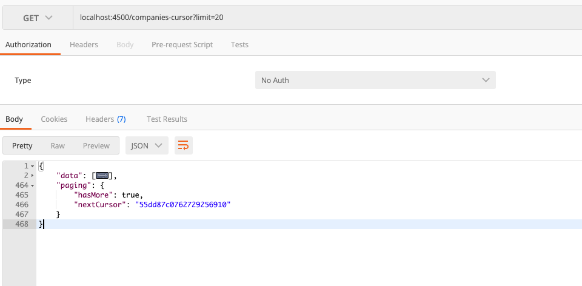
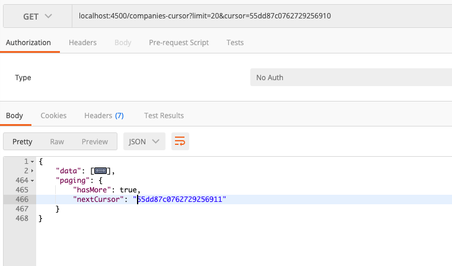

## Implementing Pagination with Mongoose and Nodejs

This Repository is to demonstrate how to implement Pagination(Offset based and Cursor based) with Mongoose and Nodejs(Handling 1M records)

For sample dataset from [MongoDB JSON](https://github.com/ozlerhakan/mongodb-json-files) and import them into MongoDB Atlas

[MongoDB import JSON file](https://docs.mongodb.com/guides/server/import/)

## Libraries Used

- Express
- Mongoose
- Crypto

Add `.env` to the root directory

```
PORT=
MONGO_URI=
```

Mainly, there are two types of Pagination. They are,

- Offset based pagination
- Cursor based Pagination

#### Offset based Pagination

It mainly uses **limit** and **offset** to fetch the data from database.

```javascript
const limit = parseInt(req.query.limit);
const offset = parseInt(req.query.skip);

const tradesCollection = await Trades.find().skip(offset).limit(limit);
```

**Demo**


#### Cursor based Pagination

Cursor based pagination is different from offset based pagination. Here, it uses the next record from the current limited data and uses it as a cursor for next data fetch.

It's important to use a unique and sequential value from database. Here, we take a `time` field from database

```javascript
tradesCollection = await Trades.find({})
  .sort({ time: -1 })
  .limit(limit + 1);

/* Find the extra record and generate a cursor from it 
 Once, it's done, we need to remove it from the user result.
*/
const nextCursorRecord = tradesCollection[limit];

var unixTimestamp = Math.floor(nextCursorRecord.time.getTime() / 1000);

nextCursor = encrypt(unixTimestamp.toString());
tradesCollection.pop();
```

**Initial Fetch**



**With Cursor**


